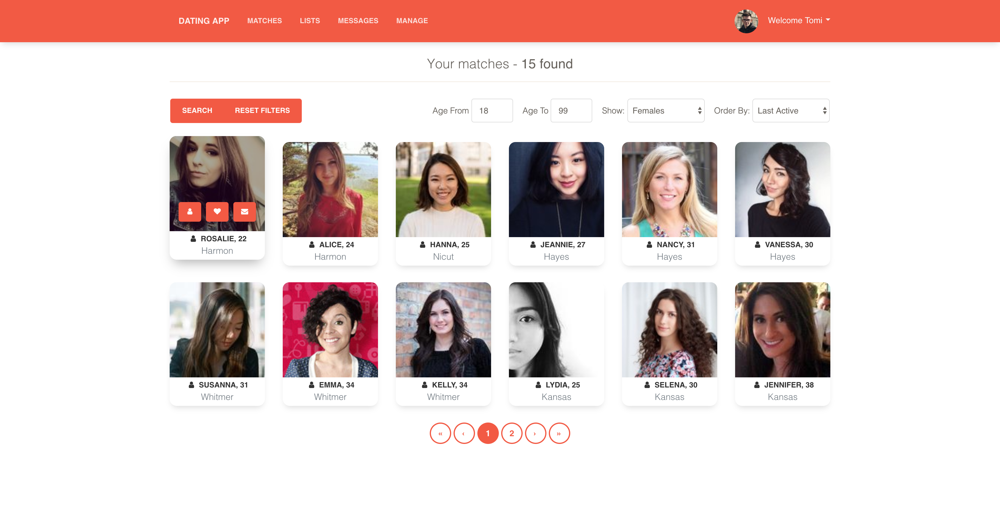
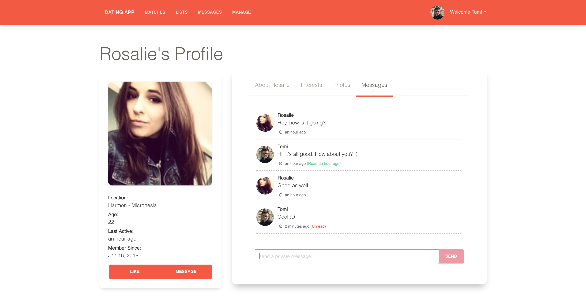
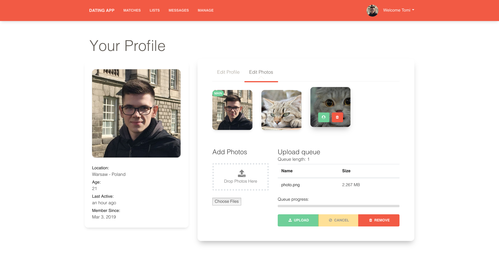

# DatingApp

### About project

A single page application made with Angular and ASP.NET Core as the backend. It allows users to login, browse other members' profiles, follow them and chat.

### Technology

ASP.NET Core 2.2.0

- AutoMapper
- CloudinaryDotNet
- EntityFrameworkCore.SqlServer

Angular 6.0.8

- angular-jwt
- ngx-gallery
- ngx-bootstrap
- ng2-file-upload
- time-ago-pipe
- Paper Kit 2 Angular theme

### Screenshots

Matches:

Messages:

Edit Profile:

